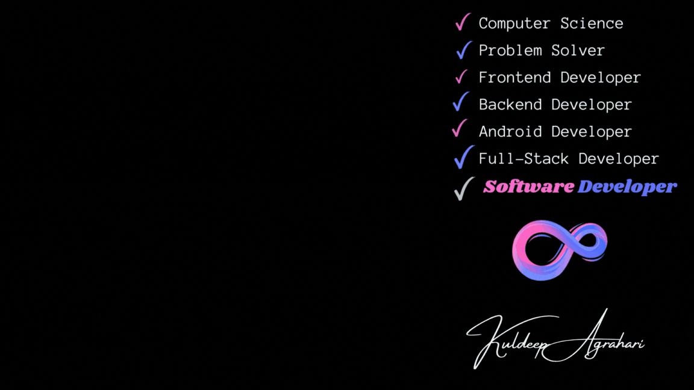

    <h1> Hi there, I'm Kuldeep Agrahari</h1>
    

 

<b>Software Developer | Problem Solver | ⭐⭐⭐ Rating on CodeChef | ⭐⭐⭐⭐ Rating on GFG | UG 2026 | CSE | PDPM IIITDM Jabalpur</b>
 

<strong>
- 🌱 I’m a Full Stack Developer who is always excited to implement new ideas into my projects. 
- 🏢 Always ready to learn new technologies. 
- 🤷 Problem solving is my first love. 
</strong>
 

    
    

   <h2>🚀 Skills and Technologies I Know</h2>
    <table>
        <tr>
            <td>
       <h3>Languages & Runtime</h3>
        
        
        
        
        
        
            </td>
<td>
  <!-- Frontend -->
    <h3>Frontend</h3>
  
  
  
  
  
  
  

  </td>
</tr>
<tr>
    <td>
  <!-- Backend -->
        <h3>Backend</h3>
  
  
  
  
  
    </td>
    <td>
  

  <!-- Databases -->
  <h3>Database</h3>
  
  
  
  

  </td>
  </tr>
  <tr>
  <td>
  <h3>Cloud / Devops</h3>
  <!-- Cloud / DevOps -->
  
  
  
  

  </td>
  <td>
  <h3>Developer Tools</h3>
  <!-- Tools -->
  
  
  
  
  
  

  
</td>
</tr>
 </table>

 

 

<h2 align="center">Reach Me Through</h2>
<table align="center" border="none"> <tr>
<td border="none">
    

</td><td>

    
    
    

</td></tr></table>
<h2 align="center">GitHub Stats</h2>

    
     
    
     
    

    

    

