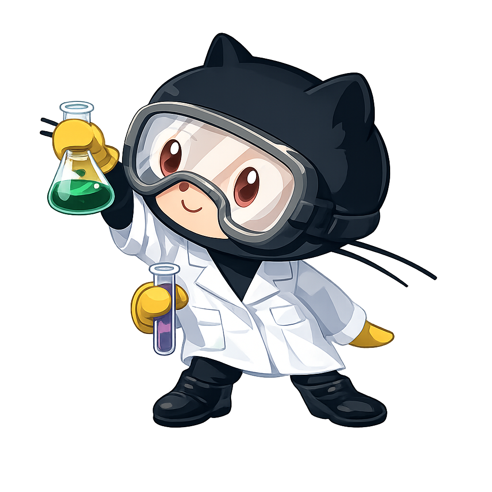

<!-- HERO SECTION -->


<div align="center">



<div align="left">

<p>
  <strong>Let's connect and have a chat ☕</strong>
</p>

<a href="https://www.linkedin.com/in/Kuldeepagrahari/">
  
</a>

<a href="https://twitter.com/kuldeep_106">
  
</a>

<a href="mailto:kuldeepagrahari9103@gmail.com">
  
</a>

<br/><br/>


</div>

<br clear="right"/>

</div>


## `~/connect`

<div align="center">

[](mailto:kuldeepagrahari9103@gmail.com)
[](https://www.linkedin.com/in/Kuldeepagrahari/)
[](https://github.com/Kuldeepagrahari)
[](https://my-portfolio-weld-beta-40.vercel.app/)
[](https://twitter.com/kuldeep_106)
[](https://leetcode.com/u/kuldeep144/)

</div>

## `~/about`

```ts
const kuldeep = {
  intro: {
    name      : "Kuldeep Agrahari",
    location  : "Prayagraj (UP), India",
    education: {
        college : "PDPM IIITDM Jabalpur",
        degree  : "B.Tech in Computer Science & Engineering",
        batch   : "2022 - 2026"
    },
  },

  about: [
    "Open to impactful software engineering opportunities across backend, full-stack, systems, and scalable infrastructure domains.",

    "Comfortable working in remote, onsite, freelance, contract-based, and collaborative team environments.",

    "Interested in building reliable systems that solve real-world problems and create meaningful impact at scale.",

    "Adaptable to fast-paced learning environments, diverse teams, and global collaboration workflows."
  ],

  currently_learning: [
    "Low Level Design",
    "Cloud Infrastructure",
    "Scalable System Architecture"
  ],

  current_goal:
    "Becoming a strong Software Engineer capable of designing scalable systems used by millions 🚀",

  fun_fact:
    "My curious mind constantly pushes me to build innovative systems that solve real-world problems and create something new ⚡"
};
```

## ⚡ Tech Stack

### 💻 Languages
<p align="left">
  
  
  
  
  
  
</p>

---

### 🎨 Frontend Development
<p align="left">
  
  
  
  
  
  
  
  
  
  
</p>

---

### ⚙️ Backend & APIs
<p align="left">
  
  
  
  
  
  
  
</p>

---

### 🗄️ Databases & Caching
<p align="left">
  
  
  
  
</p>

---

### ☁️ Cloud, DevOps & Infrastructure
<p align="left">
  
  
  
  
  
  
  
  
</p>

---

### 🛠️ Developer Tools
<p align="left">
  
  
  
  
  
  
  
  
</p>


---

## `~/stats`
<table align="center" width="100%">
  <tr>
    <td width="50%" align="center" valign="middle">
      <a href="https://git.io/streak-stats">
        
      </a>
    </td>
  </tr>
</table>
<table align="center" width="100%">
  <tr>
    <td width="50%" valign="top">
      
    </td>
    <td width="50%" valign="top">
      
    </td>
  </tr>
  <tr>
    <td width="50%" valign="top">
      
    </td>
    <td width="50%" valign="top">
      
    </td>
  </tr>
</table>
---

## `~/wins`


---

<div align="center">


</div>


